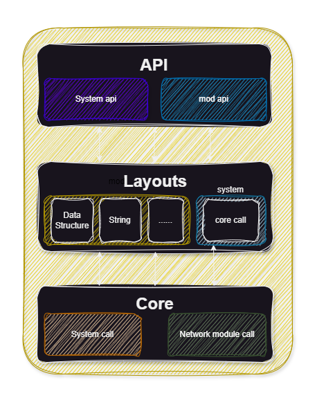

# PandaRuntimeLibrary
## 架构介绍

1. core 层: 操作系统交互层,与操作系统进行最直接的交互,负责系统调用,文件读写,网络通信等
2. layouts 层: 负责调用core 层,完成较为上层的工作,比如字符串处理,数据结构的处理等, 以及对core层进行一次封装,方便上层调用
   1. core 层: 负责完成对最底层的core调用,比如文件读写,网络通信等
   2. mod 层: 负责完成较为上次的工作,比如字符串处理,数据结构的处理等
3. api 层: 负责调用layouts 层,完成最上层的调用工作,对layouts层进行封装,比如文件读写,网络通信等
### 层级特点
1. core 层: 最底层,直接与操作系统进行交互,负责系统调用,文件读写,网络通信等,是整个系统的基础,负责最底层的调用,是最基础的的,不可缺少的,同时ta也是最难调用的,具有对操作系统的强依赖性
2. layouts 层: 负责调用core 层,完成较为上层的工作,比如字符串处理,数据结构的处理等, 以及对core层进行一次封装,方便上层调用,是较为方便调用的,具有对core层的强依赖性
3. api 层: 负责调用layouts 层,完成最简单的调用工作,最方便使用,在运行时,只要库文件符合操作系统所对应的库文件,调用是非常方便的,不需要考虑操作系统层面的约束
### 层级关系
1. core 层: core 层不依赖任何(PandaRuntimeLibrary)[https://github.com/ChinaPandaGroup/PandaRuntimeLibrary] (以下简称PRTL)的任何其他组件,对PRTL来说,是相对独立的,但同时,利用这个开发,也需要承受:
   1. 对操作系统的强依赖性,任何系统都需要单独写一段代码
2. layouts 层: layouts 层依赖core 层,对PRTL来说,是对core层有一定依赖程度的,如果你选择使用mod,就当我没说,但同时,利用这个开发,也需要承受: 
    1. 对core层的强依赖性
3. api 层: api 层依赖layouts 层,对PRTL来说,是对layouts层有一定依赖程度的,同时,利用这个开发,也需要承受:
   1. 对layouts层的强依赖性
   2. 对core层的强依赖性
   3. 对mod层的强依赖性
   4. PRTL代码会更臃肿
   但是,也有以下好处:
      1. 对操作系统不一定强相关
      2. 减少你的代码的重复